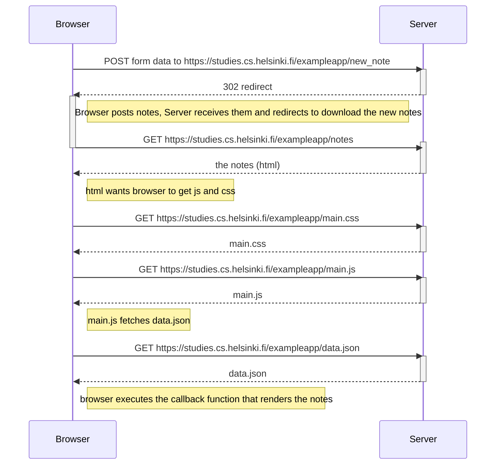

```mermaid
sequenceDiagram
    participant Browser
    participant Server
    
    Browser->>Server: POST form data to https://studies.cs.helsinki.fi/exampleapp/new_note
    activate Server
    Server-->>Browser: 302 redirect
    deactivate Server
    activate Browser

    note left of Server: Browser posts notes, Server receives them and redirects to download the new notes

    Browser->>Server: GET https://studies.cs.helsinki.fi/exampleapp/notes
    activate Server
    deactivate Browser
    Server -->>Browser: the notes (html)
    deactivate Server
    
    note right of Browser: html wants browser to get js and css

    Browser->>Server: GET https://studies.cs.helsinki.fi/exampleapp/main.css
    activate Server
    Server-->>Browser: main.css
    deactivate Server

    Browser->>Server: GET https://studies.cs.helsinki.fi/exampleapp/main.js
    activate Server
    Server-->>Browser: main.js
    deactivate Server

    note right of Browser: main.js fetches data.json

    Browser->>Server: GET https://studies.cs.helsinki.fi/exampleapp/data.json
    activate Server
    Server-->>Browser: data.json
    deactivate Server

    note right of Browser: browser executes the callback function that renders the notes
```